# Smart Invoice Processor AI

Enterprise-grade Azure AI powered invoice processing platform built using a multi-agent architecture.

**Author:** Syed Ali Haider

---

## Project Overview

This solution automates invoice processing using Azure AI services and a multi-agent workflow.

The system can extract invoice data from PDFs/images, process multiple invoices in one batch, validate invoice information, detect duplicates, convert multiple currencies to GBP, classify expenses, detect fraud, generate executive reports, run approval workflow decisions, store results in Azure Cosmos DB, and provide analytics dashboards.

---

# Azure AI Smart Invoice Processor

Enterprise-grade multi-agent invoice processing system built using Azure OpenAI, Azure Document Intelligence, Cosmos DB, Managed Identity, and Streamlit.

---

## Features

✅ Multi-agent invoice processing (6 agents)

✅ PDF and image invoice support

✅ Batch invoice processing

✅ Multi-currency conversion to GBP

✅ Duplicate invoice detection

✅ Fraud risk scoring

✅ Automated approval workflow

✅ Vendor analytics and spend tracking

✅ Interactive analytics dashboard

✅ Invoice history explorer

✅ One-click invoice data deletion from Cosmos DB

✅ JSON, CSV, Excel and PDF exports

✅ Managed Identity authentication

---


## Architecture

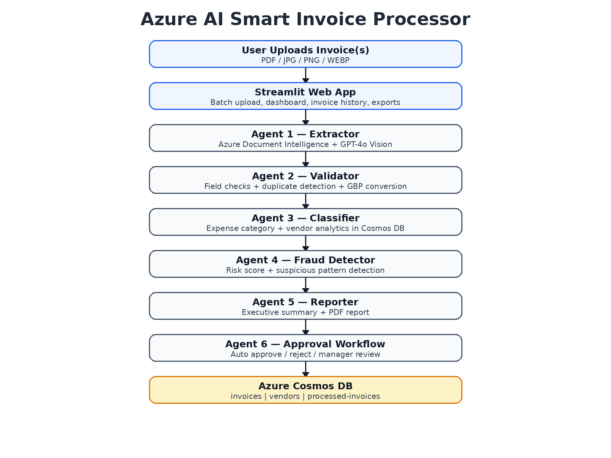

---

## Azure Services Used

| Service | Purpose |
|---|---|
| Azure OpenAI GPT-4o | Classification, reasoning, reporting |
| Azure Document Intelligence | Invoice OCR and extraction |
| Azure Cosmos DB | Invoice storage, duplicate detection, vendor analytics |
| Azure AI Foundry | AI project and deployment management |
| Managed Identity | Secure authentication without API keys |
| Streamlit | Web application frontend |

---

## Multi-Agent Architecture

### Agent 1 — Invoice Extractor
Extracts structured invoice data from PDFs and images using Azure Document Intelligence and GPT-4o Vision.

### Agent 2 — Validator
Validates required fields, invoice dates, amount consistency, duplicate checks, and GBP currency conversion.

### Agent 3 — Classifier
Classifies invoices into expense categories and stores vendor analytics in Azure Cosmos DB.

### Agent 4 — Fraud Detector
Scores fraud risk and flags suspicious invoice patterns.

### Agent 5 — Reporter
Creates executive summaries, finance action items, and report exports.

### Agent 6 — Approval Workflow
Applies business rules for approval, rejection, manager review, and finance review.

| Condition | Decision |
|---|---|
| Duplicate invoice | Rejected |
| Fraud score >= 70 | Finance approval |
| GBP amount > 1000 | Manager approval |
| Validation errors | Rejected |
| Low-risk valid invoice | Auto-approved |

---

## Security

The project uses enterprise-style Azure authentication:

- `DefaultAzureCredential`
- Azure Managed Identity
- Azure RBAC
- No API keys in source code

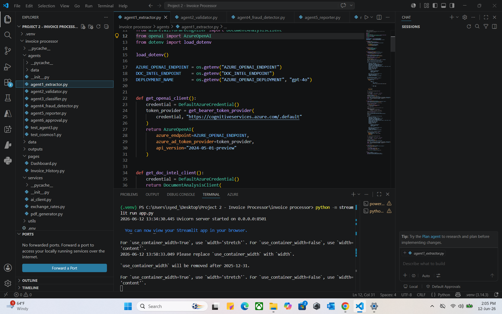

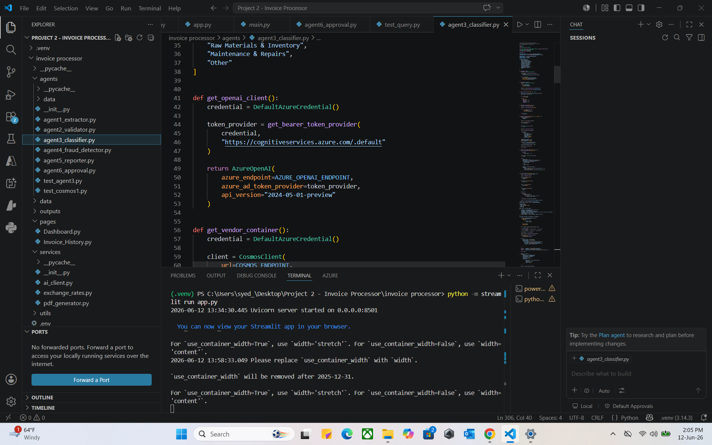

---

## Azure Resources

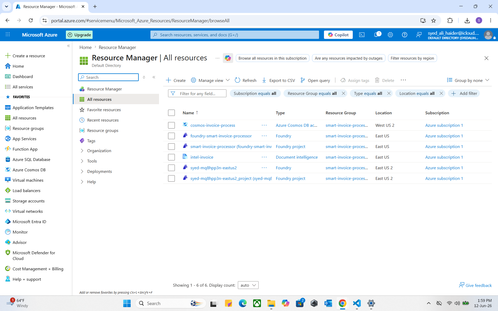

---

## Cosmos DB Storage

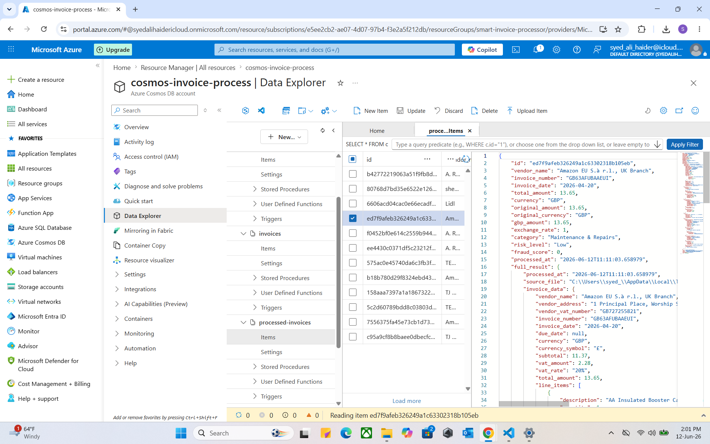

Database: `invoice-db`

Containers:

| Container | Purpose |
|---|---|
| invoices | Invoice hashes and duplicate detection |
| vendors | Vendor history and monthly spend |
| duplicates | Duplicate tracking |
| processed-invoices | Full processed invoice output |

---

## Screenshots

### Upload Multiple Invoices
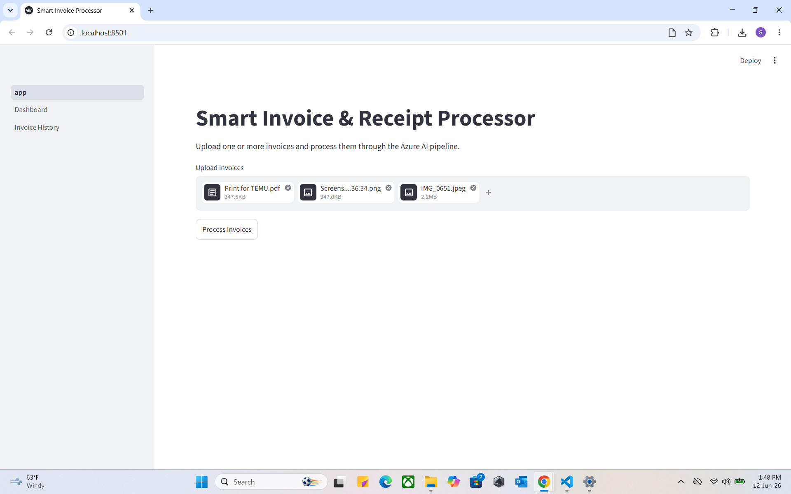

### Batch Processing
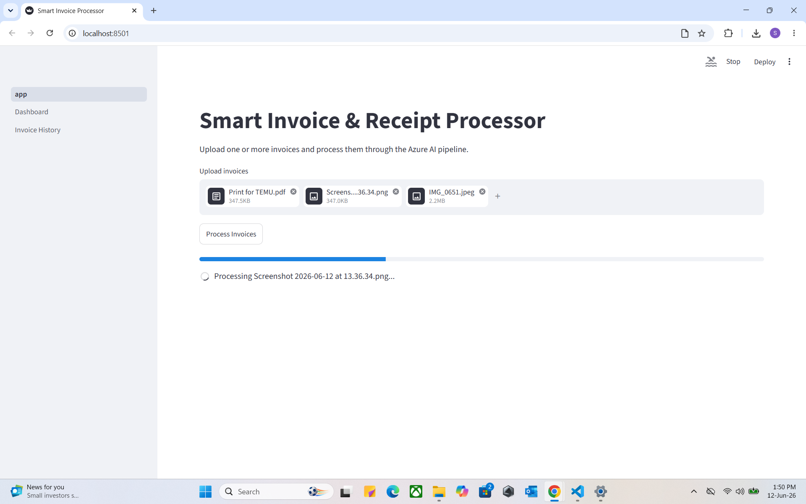

### Invoice Extraction
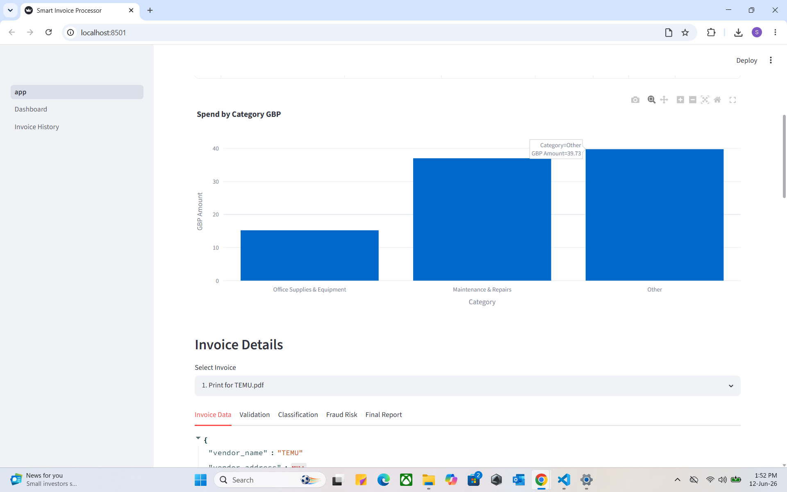

### Validation and Currency Conversion
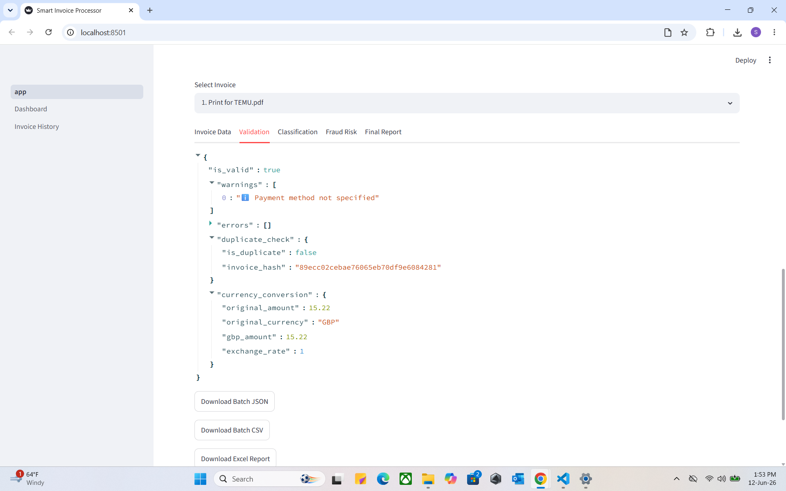

### Classification
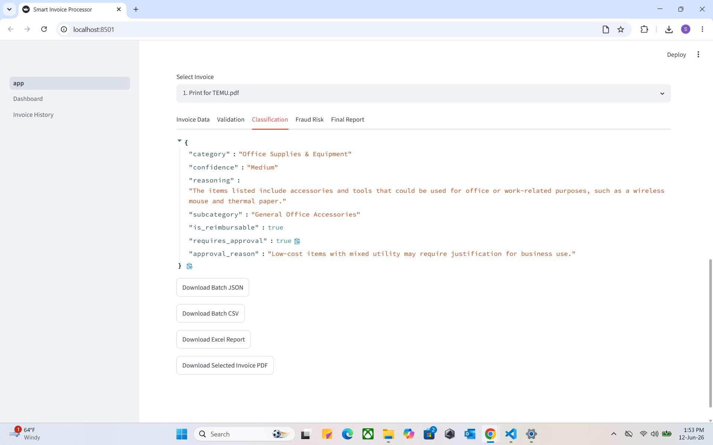

### Fraud Detection
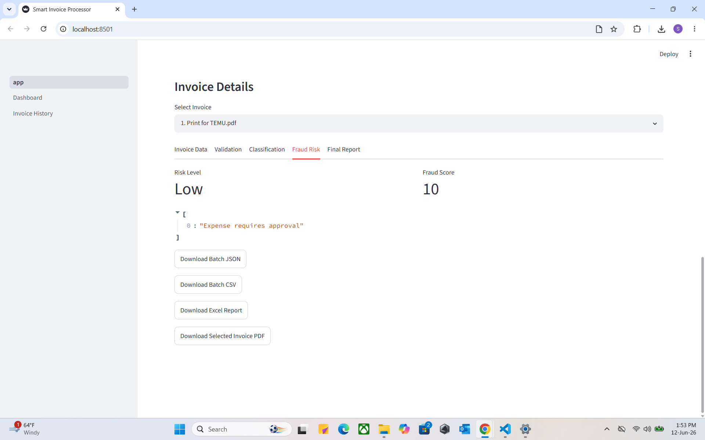

### Final Report
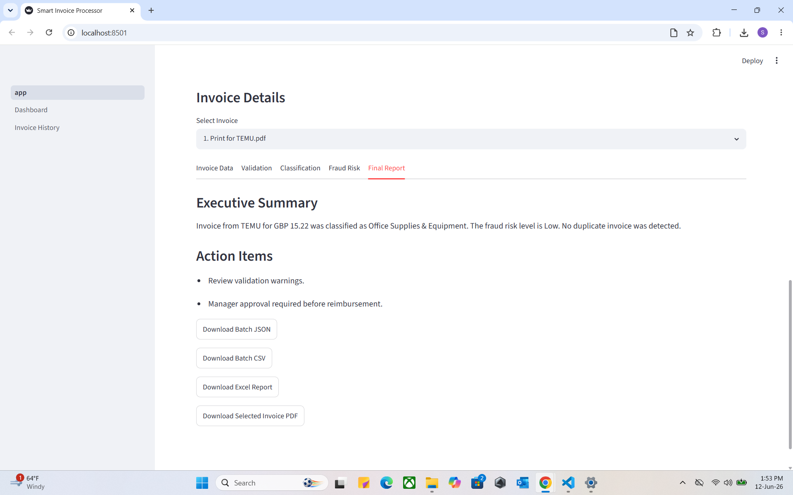

### Enhanced Analytics Dashboard
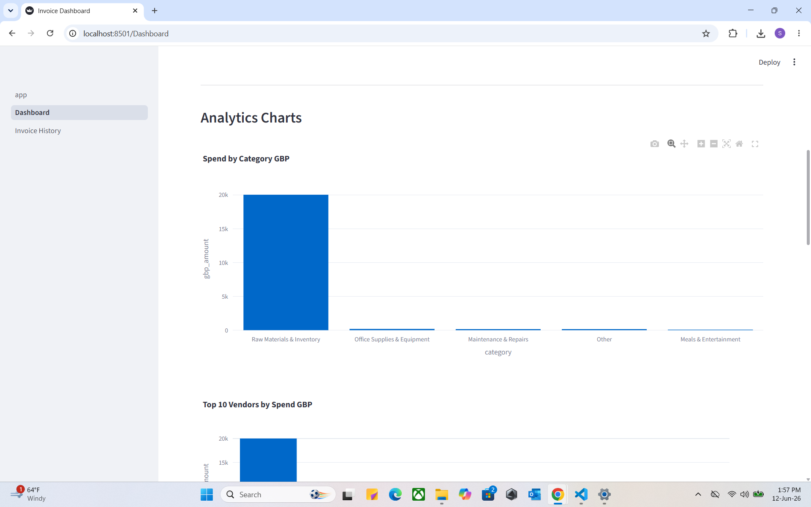

### Invoice History
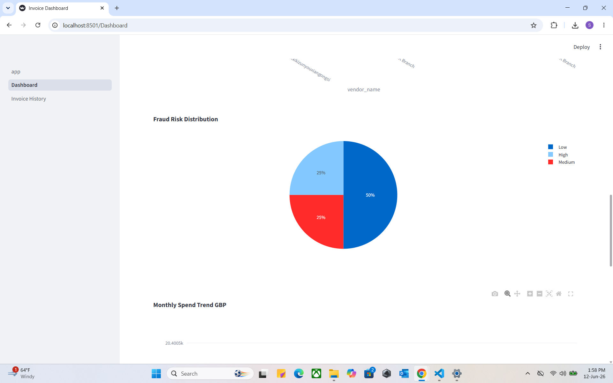

---

## Example Output

```json
{
  "vendor_name": "TEMU",
  "invoice_number": "INV-WUL-GB-1040311026984",
  "total_amount": 15.22,
  "currency": "GBP",
  "gbp_amount": 15.22,
  "category": "Office Supplies & Equipment",
  "risk_level": "Low",
  "fraud_score": 10,
  "approval_status": "Pending"
}
```

---

## Project Structure

```text
azure-ai-smart-invoice-processor/
├── agents/
│   ├── agent1_extractor.py
│   ├── agent2_validator.py
│   ├── agent3_classifier.py
│   ├── agent4_fraud_detector.py
│   ├── agent5_reporter.py
│   └── agent6_approval.py
├── services/
│   ├── exchange_rates.py
│   └── pdf_generator.py
├── pages/
│   ├── Dashboard.py
│   └── Invoice_History.py
├── screenshots/
├── docs/
├── app.py
├── run_pipeline.py
├── requirements.txt
├── .env.example
├── .gitignore
└── README.md
```

---

## Environment Variables

Create a `.env` file locally:

```env
AZURE_OPENAI_ENDPOINT=
AZURE_OPENAI_DEPLOYMENT=gpt-4o
DOC_INTEL_ENDPOINT=
COSMOS_ENDPOINT=
```

Do **not** commit `.env` to GitHub.

---

## Running Locally

```bash
git clone https://github.com/YOUR_USERNAME/azure-ai-smart-invoice-processor.git
cd azure-ai-smart-invoice-processor
python -m venv .venv
python -m pip install -r requirements.txt
az login
python -m streamlit run app.py
```

---

## Business Value

This solution helps finance teams reduce manual invoice processing, duplicate payments, fraud risk, approval delays, and reporting effort.

---

## Skills Demonstrated

Azure AI Engineering, Azure OpenAI GPT-4o, Azure Document Intelligence, Azure Cosmos DB, Managed Identity and RBAC, multi-agent AI system design, Streamlit development, Python backend development, finance workflow automation, fraud detection, and dashboard analytics.

---

## Future Enhancements

- Azure App Service deployment
- Email alerts for high-risk invoices
- Power BI dashboard
- Role-based access control
- Azure Blob Storage for original invoice files
- Human approval workflow UI
- SAP / Dynamics 365 integration

---

## Disclaimer

This project is a portfolio demonstration of an AI-powered invoice processing workflow. It should be reviewed, secured and tested further before production finance use.
