# Azure AI Smart Invoice Processor


Enterprise-grade multi-agent invoice processing system built using Azure OpenAI, Azure Document Intelligence, Cosmos DB, Managed Identity, and Streamlit.


**Author:** Syed Ali Haider

---

## 🎥 Demo Video

🎬 [Watch the Project Video](https://www.loom.com/share/ebf9765420e84c7c9692db3ccc587571)

---

## Project Overview

This solution automates invoice processing using Azure AI services and a multi-agent workflow.

The system can extract invoice data from PDFs/images, process multiple invoices in one batch, validate invoice information, detect duplicates, convert multiple currencies to GBP, classify expenses, detect fraud, generate executive reports, run approval workflow decisions, store results in Azure Cosmos DB, and provide analytics dashboards.

---


## Features

✅ Multi-agent invoice processing (6 agents)

✅ PDF and image invoice support

✅ Batch invoice processing

✅ Multi-currency conversion to GBP

✅ Duplicate invoice detection

✅ Fraud risk scoring

✅ Automated approval workflow

✅ Vendor analytics and spend tracking

✅ Interactive analytics dashboard

✅ Invoice history explorer

✅ One-click invoice data deletion from Cosmos DB

✅ JSON, CSV, Excel and PDF exports

✅ Managed Identity authentication

---


## Architecture

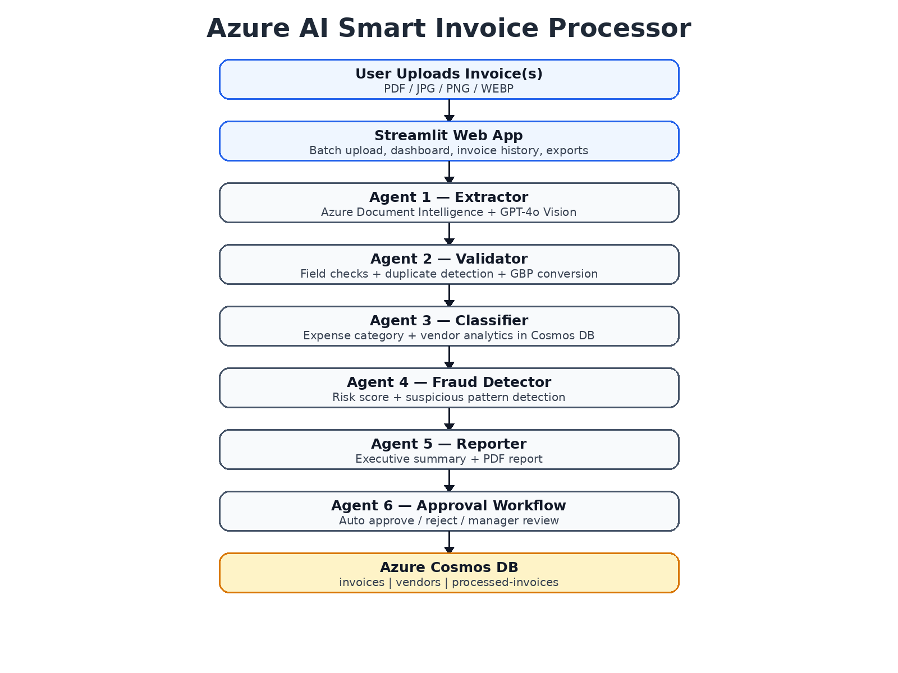

---

## Azure Services Used

| Service | Purpose |
|---|---|
| Azure OpenAI (GPT-4.1-mini) | Vision extraction, classification, reasoning |
| Azure Document Intelligence | Invoice OCR and extraction |
| Azure Cosmos DB | Invoice storage, duplicate detection, vendor analytics |
| Azure AI Foundry | AI project and deployment management |
| Managed Identity / service principal | Entra ID authentication without API keys |
| Streamlit | Web application frontend |

---

## Multi-Agent Architecture

### Agent 1 — Invoice Extractor
Extracts structured invoice data from PDFs and images using Azure Document Intelligence (PDFs) and GPT-4.1-mini vision (images).

### Agent 2 — Validator
Validates required fields, invoice dates, amount consistency, duplicate checks, and GBP currency conversion.

### Agent 3 — Classifier
Classifies invoices into expense categories and stores vendor analytics in Azure Cosmos DB.

### Agent 4 — Fraud Detector
Scores fraud risk and flags suspicious invoice patterns.

### Agent 5 — Reporter
Creates executive summaries, finance action items, and report exports.

### Agent 6 — Approval Workflow
Applies business rules for approval, rejection, manager review, and finance review.

| Condition | Decision |
|---|---|
| Duplicate invoice | Rejected |
| Fraud score >= 70 | Finance approval |
| GBP amount > 1000 | Manager approval |
| Validation errors | Rejected |
| Low-risk valid invoice | Auto-approved |

---

## Security

The project uses enterprise-style Azure authentication:

- `DefaultAzureCredential`: Managed Identity on Azure, a least-privilege service principal on Streamlit Community Cloud, `az login` locally
- Azure RBAC data-plane roles (Cognitive Services OpenAI User, Cognitive Services User, Cosmos DB Built-in Data Contributor)
- Key-based auth disabled on every Azure resource, so there are no API keys to leak
- Public demo guardrails: 3 invoices per batch, 5 MB upload cap, rolling daily invoice limit, low OpenAI TPM quota, password-protected admin delete

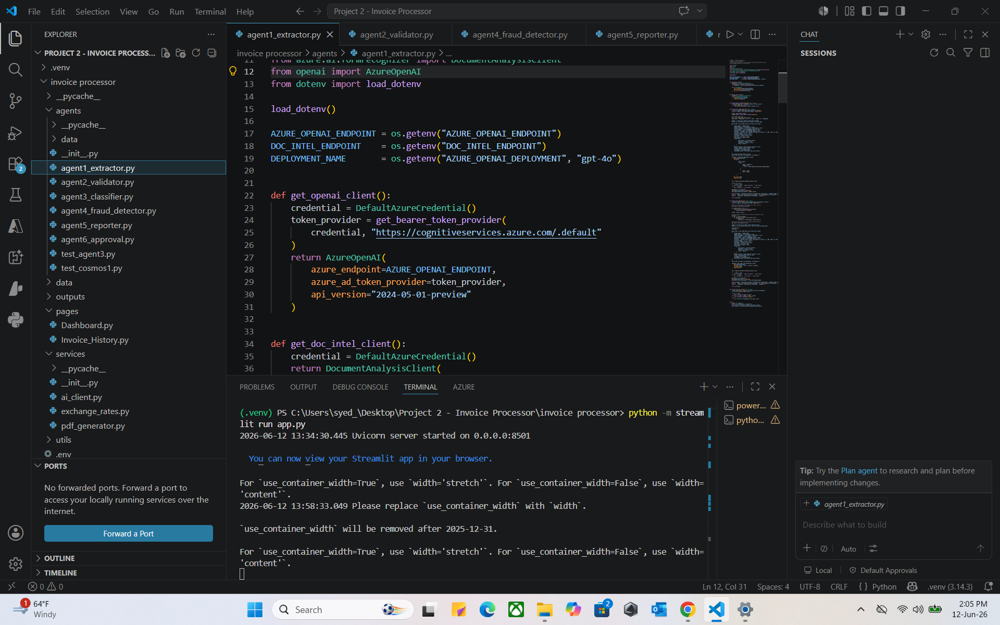

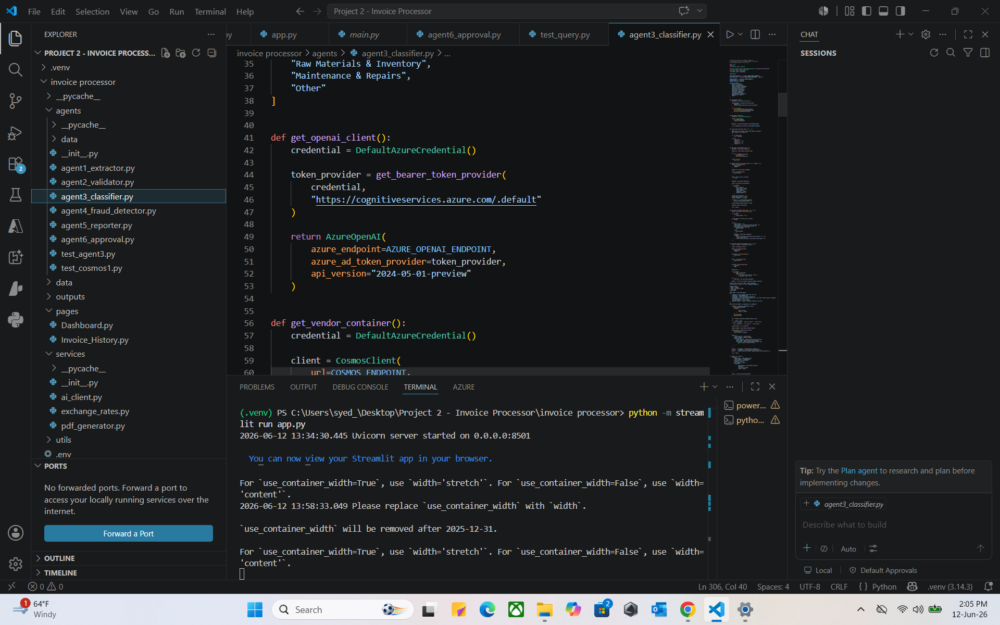

---

## Azure Resources

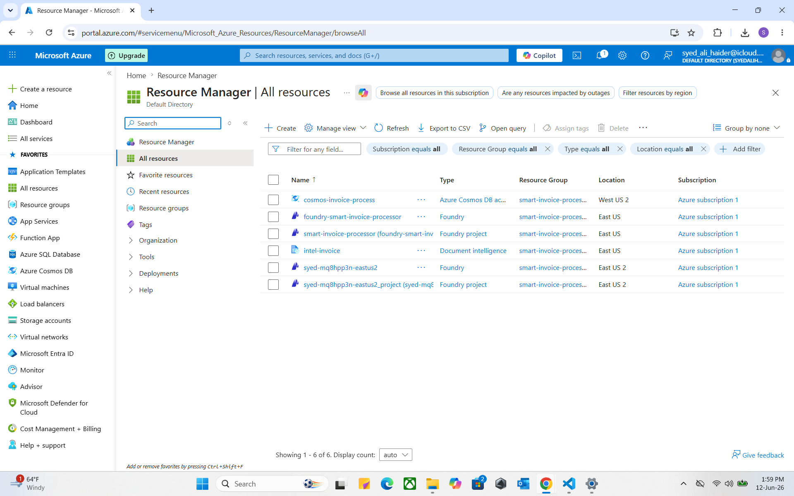

---

## Cosmos DB Storage

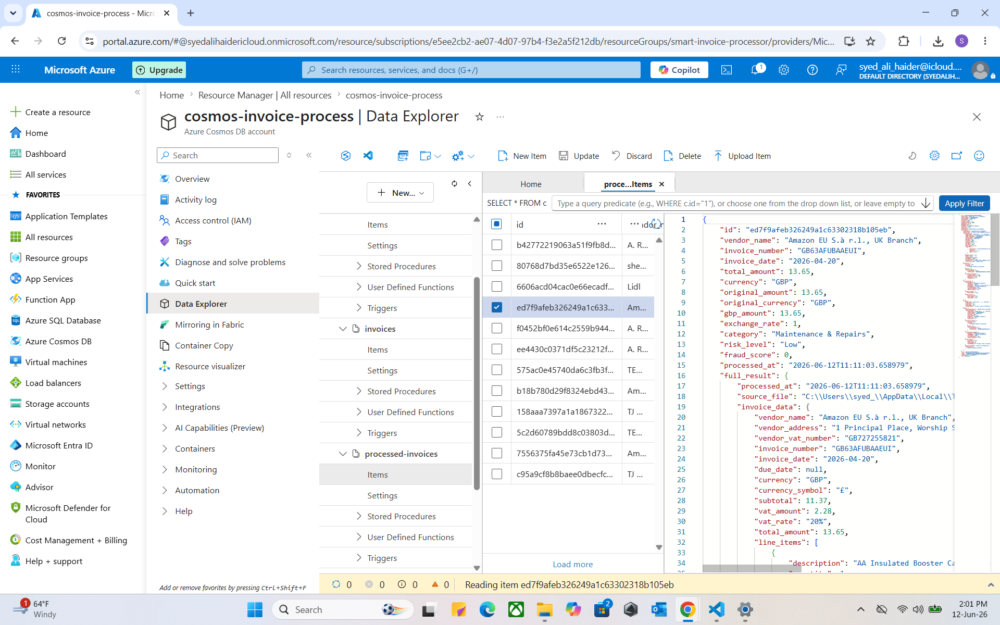

Database: `invoice-db`

Containers:

| Container | Purpose |
|---|---|
| invoices | Invoice hashes and duplicate detection |
| vendors | Vendor history and monthly spend |
| duplicates | Duplicate tracking |
| processed-invoices | Full processed invoice output |

All containers are partitioned on `/id` and have a 24-hour TTL in the public demo, so uploaded data is deleted automatically.

---

## Screenshots

### Upload Multiple Invoices
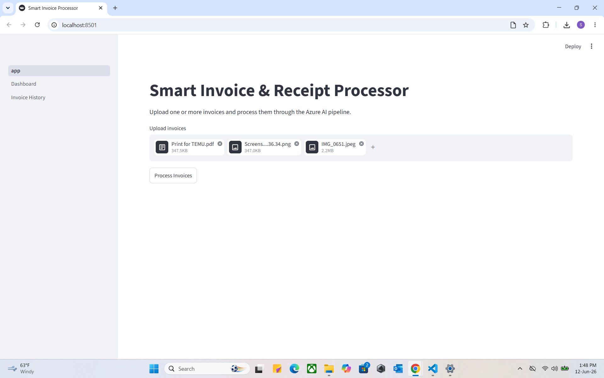

### Batch Processing
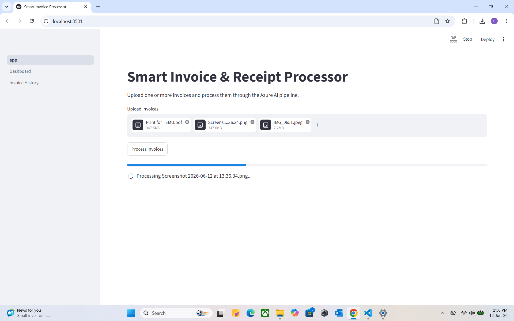

### Invoice Extraction
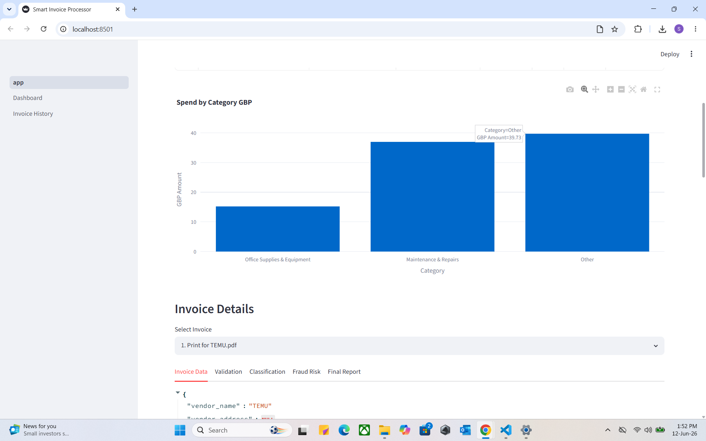

### Validation and Currency Conversion
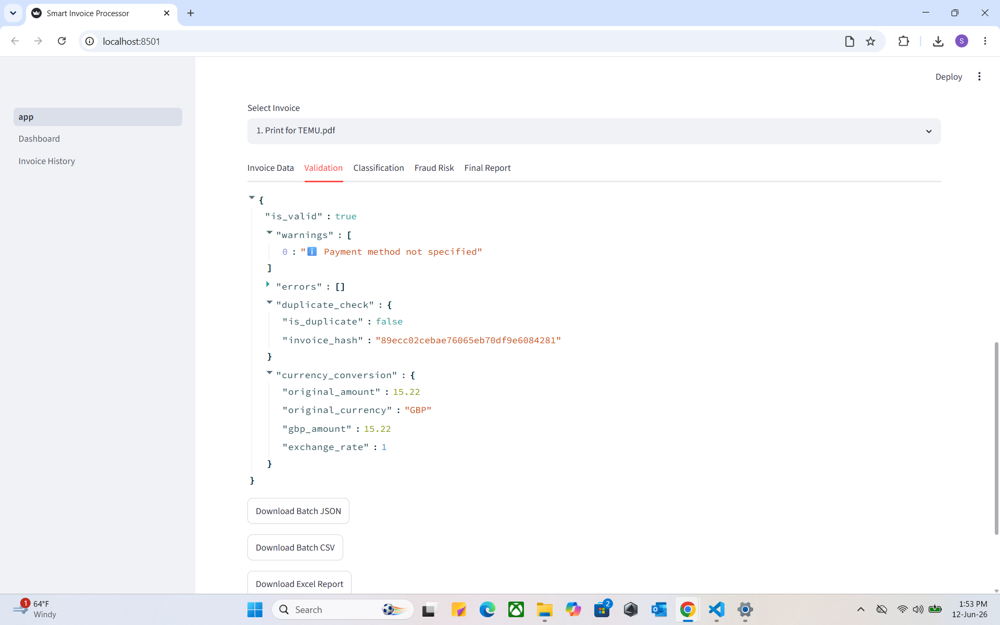

### Classification
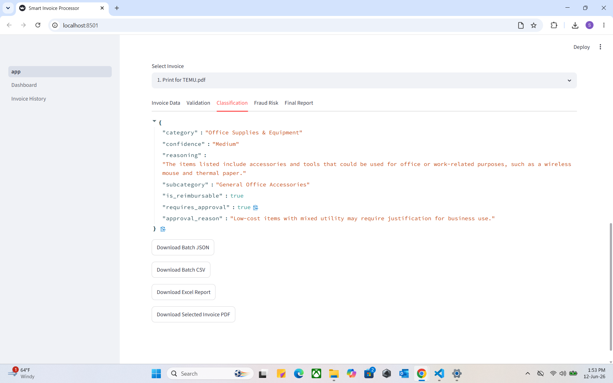

### Fraud Detection
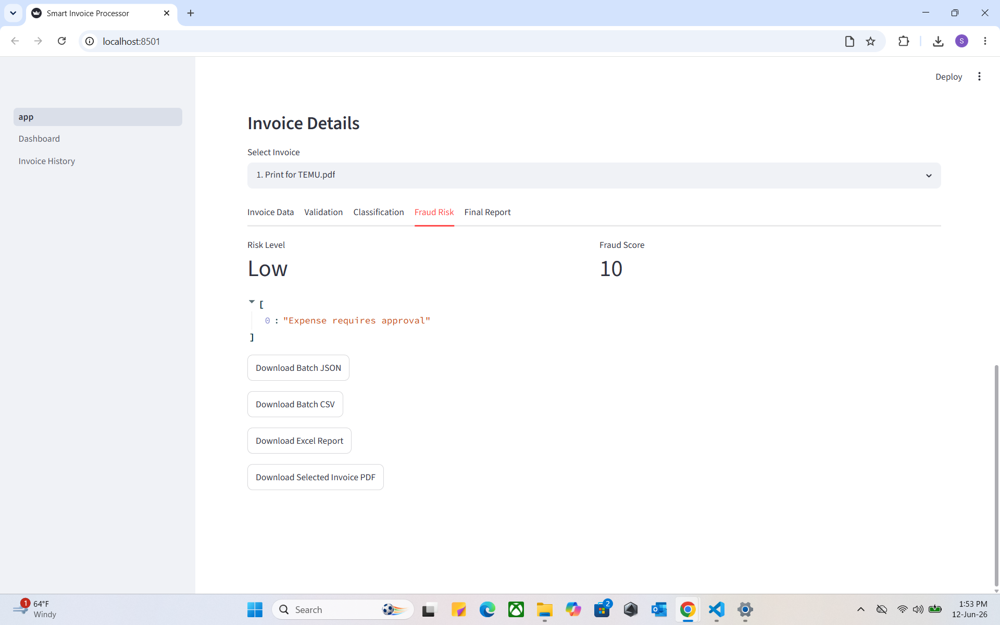

### Final Report
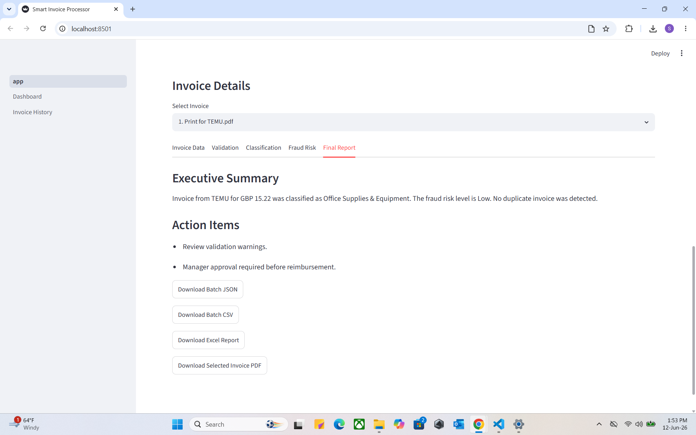

### Enhanced Analytics Dashboard
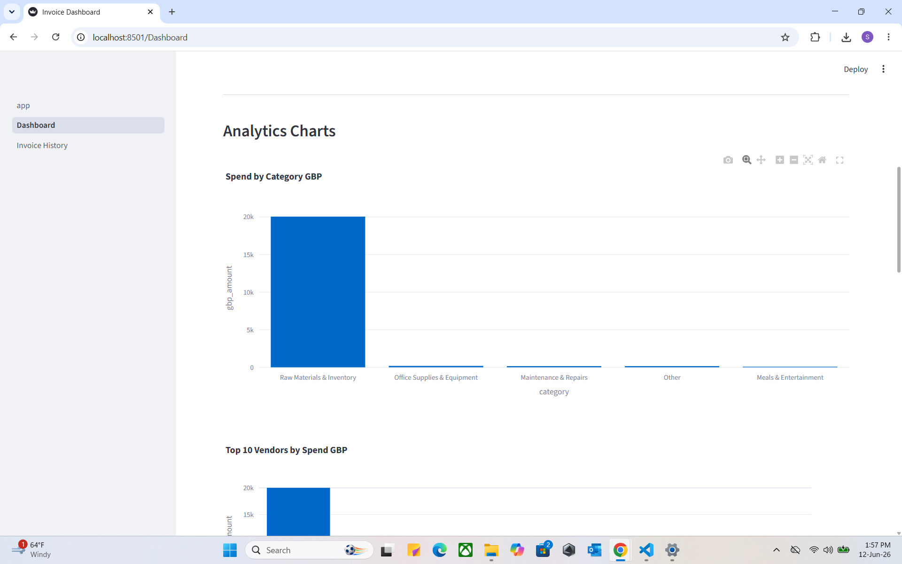

### Invoice History
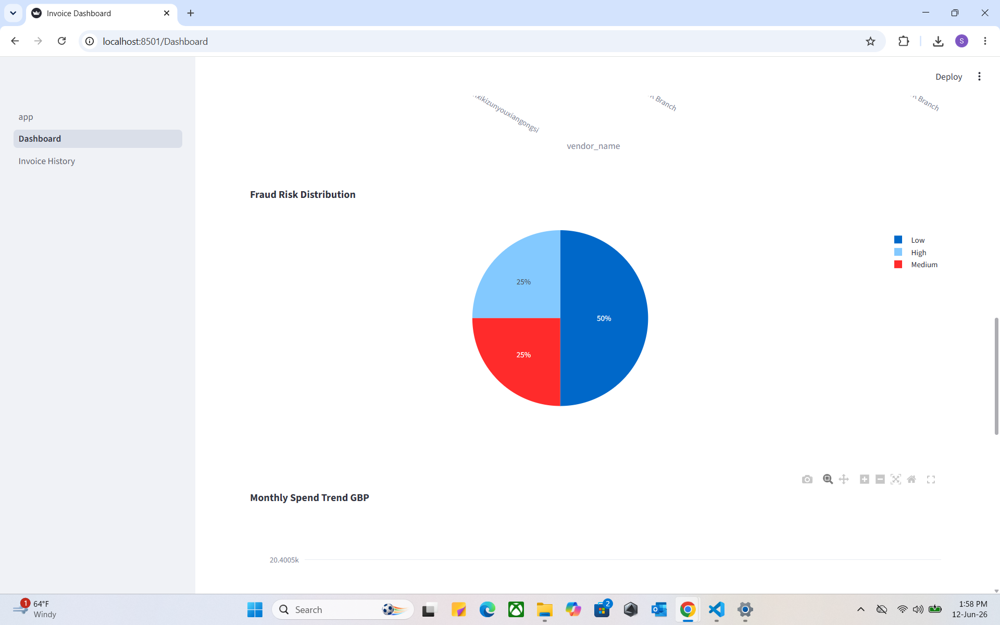

---

## Example Output

```json
{
  "vendor_name": "TEMU",
  "invoice_number": "INV-WUL-GB-1040311026984",
  "total_amount": 15.22,
  "currency": "GBP",
  "gbp_amount": 15.22,
  "category": "Office Supplies & Equipment",
  "risk_level": "Low",
  "fraud_score": 10,
  "approval_status": "Pending"
}
```

---

## Project Structure

```text
azure-ai-smart-invoice-processor/
├── agents/
│   ├── agent1_extractor.py
│   ├── agent2_validator.py
│   ├── agent3_classifier.py
│   ├── agent4_fraud_detector.py
│   ├── agent5_reporter.py
│   └── agent6_approval.py
├── services/
│   ├── azure_clients.py
│   ├── exchange_rates.py
│   └── pdf_generator.py
├── pages/
│   ├── Process_Invoices.py
│   ├── Dashboard.py
│   └── Invoice_History.py
├── samples/              # fictional demo invoices
├── scripts/
│   └── generate_samples.py
├── infra/
│   └── setup_azure.sh    # creates all Azure resources + RBAC
├── .streamlit/
│   └── config.toml
├── screenshots/
├── docs/
├── app.py              # navigation entry point
├── run_pipeline.py
├── requirements.txt
├── .env.example
├── .gitignore
└── README.md
```

---

## Deploying the Live Demo

The demo runs on **Streamlit Community Cloud** (free) with an Azure AI backend kept close to zero cost.

### 1. Create the Azure resources

```bash
git clone https://github.com/alihaider1993/azure-ai-smart-invoice-processor.git
cd azure-ai-smart-invoice-processor
az login
bash infra/setup_azure.sh
```

The script creates the following in UK South (override with `LOCATION=...`):

| Resource | Tier | Cost |
|---|---|---|
| Azure OpenAI, `gpt-4.1-mini` Global Standard | 10K TPM quota | Pay per token, well under 1p per invoice |
| Document Intelligence | F0 | Free (500 pages/month) |
| Cosmos DB `invoice-db` (4 containers, 24h TTL) | Free tier, 400 RU/s shared | Free |

It also creates a service principal, grants it and you the RBAC roles, disables key-based auth, and writes `.streamlit/secrets.toml` (git-ignored).

Then add a **budget alert** in the Azure portal (Cost Management > Budgets, for example £5/month) so you get an email if costs ever rise.

### 2. Test locally

```bash
python -m venv .venv
.venv\Scripts\activate          # macOS/Linux: source .venv/bin/activate
pip install -r requirements.txt
streamlit run app.py
```

### 3. Deploy to Streamlit Community Cloud

1. Push to GitHub and sign in at [share.streamlit.io](https://share.streamlit.io).
2. **Create app** from this repo, branch `main`, main file `app.py`, and pick a custom subdomain.
3. Under **Advanced settings**, choose Python 3.12 and paste into **Secrets** the contents of `.streamlit/secrets.toml`.
4. Deploy, then process a sample invoice to confirm everything works.

See `.env.example` for every setting. Never commit `.env` or `.streamlit/secrets.toml`.

---

## Business Value

This solution helps finance teams reduce manual invoice processing, duplicate payments, fraud risk, approval delays, and reporting effort.

---

## Skills Demonstrated

Azure AI Engineering, Azure OpenAI, Azure Document Intelligence, Azure Cosmos DB, Managed Identity and RBAC, multi-agent AI system design, Streamlit development, Python backend development, finance workflow automation, fraud detection, and dashboard analytics.

---

## Future Enhancements

- Azure App Service deployment
- Email alerts for high-risk invoices
- Power BI dashboard
- Role-based access control
- Azure Blob Storage for original invoice files
- Human approval workflow UI
- SAP / Dynamics 365 integration

---
## 👨‍💻 About Me & Why I Built This

My name is **Syed Ali Haider**. I'm transitioning into AI roles. 

Businesses around the world process large volumes of invoices every day. In most  organisations, finance teams manually extract invoice data, validate details, detect  duplicates, categorise expenses, and approve payments. This process is time-consuming,  error-prone, and difficult to scale.

I built this to change that. Users can upload a PDF invoice or simply take a photo of a receipt on their phone — the system automatically extracts the data, validates it, detects potential fraud, classifies the expense, and generates an approval recommendation. No manual effort required.

This project demonstrates how Generative AI and multi-agent architectures can solve real business problems at scale. It is particularly relevant for organisations processing hundreds or thousands of invoices daily — helping them improve efficiency, reduce errors, and gain better visibility into their financial operations.

**What I learned building this:**
The hardest part wasn't the code — it was configuring RBAC and Managed Identity permission chains across Azure AI Foundry, Document Intelligence, and Cosmos DB. 
Real Azure deployments are about permissions as much as architecture. I debugged errors, understood the fixes, and built something that works end-to-end.


[LinkedIn](https://www.linkedin.com/in/syed-ali-haider-43777821) · 
[GitHub](https://github.com/alihaider1993) · 

---
## Disclaimer

This project is a portfolio demonstration of an AI-powered invoice processing workflow. It should be reviewed, secured and tested further before production finance use.
